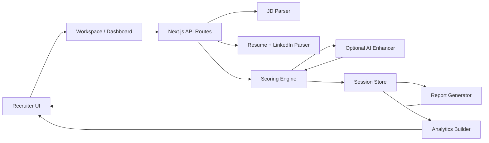
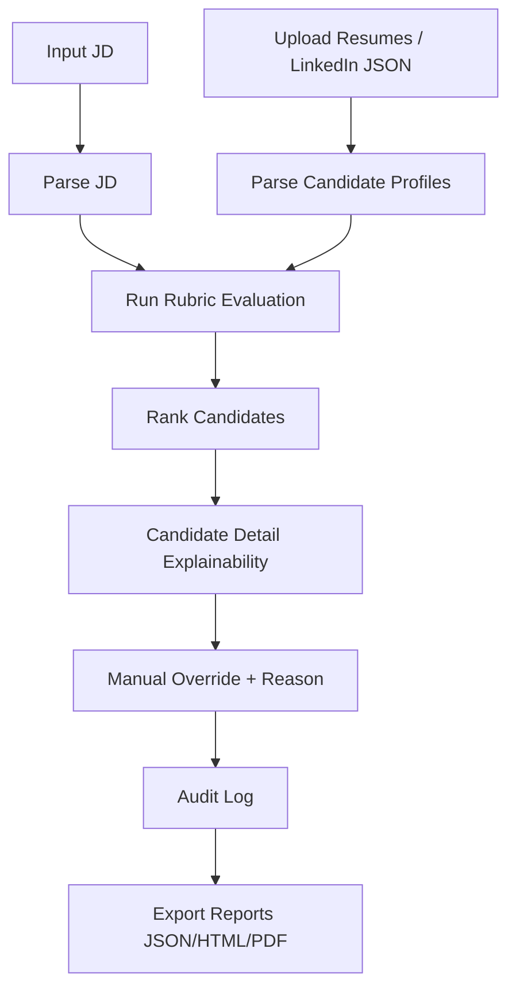

# HireWise AI — Resume & LinkedIn Shortlisting Agent

Production-quality HR-tech AI assistant for JD-to-candidate screening with transparent scoring, ranked shortlists, human override auditability, and downloadable reports.

## Problem Statement
Recruiters screen high volumes of resumes under time pressure, which creates:
- inconsistent evaluation criteria,
- missed strong candidates,
- fatigue and decision drift,
- bias risk when unstructured profiles are reviewed manually.

## Solution Overview
HireWise AI ingests a Job Description plus multiple resumes/LinkedIn JSON profiles, parses them into structured data, scores candidates using a transparent mandatory rubric, and presents a ranked shortlist with explanations and recruiter override controls.

It is explicitly decision-support, not autonomous hiring.

## Core Features
- JD parser (text/file) with structured extraction
- Resume ingestion (PDF/DOCX/TXT) + LinkedIn JSON input
- Semantic-like matching + deterministic fallback engine
- Mandatory weighted rubric with dimension-level scoring
- Ranked shortlist dashboard with filters/search
- Candidate detail panel with explainability
- Human override + recruiter notes + full audit trail
- Report export: JSON, HTML, PDF
- Demo mode (instant preloaded JD + 7 candidates)
- Analytics dashboard (distribution, gaps, comparisons)
- Bias-aware warning system (sensitive attributes ignored in scoring)
- Configurable weights with mandatory default baseline

## Screenshots
- `docs/screenshots/landing.png` (placeholder)
- `docs/screenshots/workspace.png` (placeholder)
- `docs/screenshots/candidate-detail.png` (placeholder)
- `docs/screenshots/analytics.png` (placeholder)
- `docs/screenshots/reports.png` (placeholder)

## Tech Stack
- Frontend: Next.js (App Router), TypeScript, Tailwind CSS, Framer Motion, Recharts, Lucide
- Backend: Next.js API routes (Node runtime), Zod validation
- Parsing: `pdf-parse`, `mammoth`
- Scoring: deterministic weighted engine + pluggable AI enhancement
- Persistence: local JSON + in-memory fallback (Supabase-ready adapter path)
- Reporting: HTML/JSON generators + server-side PDF via `pdf-lib`

## Architecture Diagram


## Agent Flow Diagram


## Scoring Methodology
Formula:
```
total_score =
(skills_match_score * 0.30 +
 experience_relevance_score * 0.25 +
 education_certs_score * 0.15 +
 project_portfolio_score * 0.20 +
 communication_quality_score * 0.10) * 10
```

Recommendation thresholds:
- 85-100: Strong Shortlist
- 70-84: Shortlist
- 55-69: Review Manually
- <55: Not Recommended

Detailed rubric: `docs/scoring-methodology.md`

## Project Structure
```text
app/
  page.tsx
  workspace/page.tsx
  reports/page.tsx
  methodology/page.tsx
  api/*
components/
  ui/*
  dashboard/*
  candidate/*
  reports/*
  layout/*
lib/
  parsers/*
  scoring/*
  ai/*
  reporting/*
  types/*
  demo-data/*
  utils/*
  store/*
public/sample-data/*
docs/
  architecture.md
  scoring-methodology.md
  deployment-guide.md
```

## Run Locally
```bash
npm install
npm run dev
```
Visit `http://localhost:3000`

## Build & Lint
```bash
npm run lint
npm run build
```

## Environment Variables
See `.env.example`

Optional AI enhancement:
- `OPENAI_API_KEY` or `AI_API_KEY`
- `AI_MODEL`
- `AI_BASE_URL`

If no API key is configured, deterministic mode is used automatically.

## Demo Instructions
1. Open `/workspace`
2. Click `Try Demo Data`
3. Inspect ranked shortlist
4. Open candidate detail, review explanations
5. Apply override with reason
6. Export JSON/HTML/PDF from `/reports`

## Vercel Deployment
1. Push code to GitHub
2. Import repo in Vercel
3. Add optional env vars
4. Deploy

Detailed guide: `docs/deployment-guide.md`

## Responsible AI Disclaimer
- Sensitive attributes are ignored in score calculations.
- Tool provides recommendations, not hiring decisions.
- Human recruiter judgment is required before final action.
- Override logs are retained for auditability and transparency.

## Future Enhancements
- Supabase/Postgres production persistence adapter
- Multi-tenant recruiter auth and role-based access
- Advanced skill ontology + embedding index
- Interview question generation by candidate gap profile
- Slack/ATS integration and webhook automation

## GitHub + Vercel Quick Commands
```bash
git init
git add .
git commit -m "feat: initial hirewise ai implementation"

git remote add origin https://github.com/<username>/hirewise-ai-shortlisting-agent.git
git branch -M main
git push -u origin main
```
