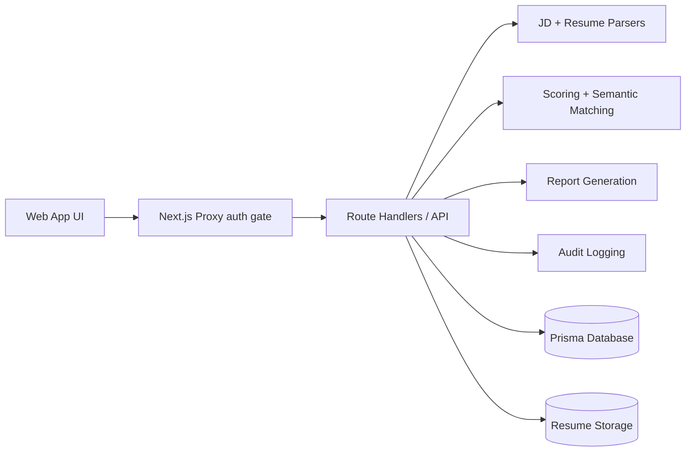
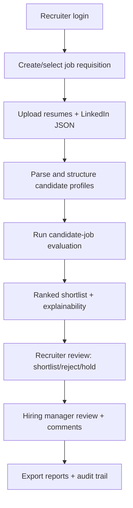

# HireWise AI - HR Shortlisting Platform

HireWise AI is a production-style HR shortlisting system for recruiters, hiring managers, and talent acquisition teams.  
It parses job descriptions and resumes, evaluates fit with transparent scoring, supports human override workflows, and produces auditable reports.

## Product Overview
This platform is designed to reduce manual screening fatigue while keeping humans in control:
- Structured JD parsing and candidate ingestion
- Role-based recruiter workflows
- Explainable candidate scoring and ranking
- Review, override, note-taking, and audit logs
- Downloadable hiring reports (JSON/HTML/PDF)
- Responsible AI guardrails for fairness and traceability

## Key Features
- Authentication and protected routes
- Multi-role access model: `ADMIN`, `RECRUITER`, `HIRING_MANAGER`, `VIEWER`
- Organization-scoped data model and APIs
- Job requisition management
- Candidate upload (PDF/DOCX/TXT) + LinkedIn JSON enrichment
- Deterministic scoring engine + optional semantic enhancement
- Candidate pipeline statuses and bulk actions
- Recruiter reviews, score overrides, and full audit history
- Analytics dashboards and skill-gap visibility
- ATS integration-ready webhook architecture
- Health endpoint and production security hardening

## Tech Stack
- Next.js 16 App Router + TypeScript
- Tailwind CSS + reusable UI components
- Prisma ORM + SQLite (current persistence engine)
- Zod validation, React Hook Form
- Recharts analytics
- `pdf-parse`, `mammoth`, `pdf-lib`
- Optional AI provider abstraction

## Architecture


## Agent Workflow


## Scoring Methodology
Mandatory rubric:
- Skills Match: 30%
- Experience Relevance: 25%
- Education and Certifications: 15%
- Project and Portfolio: 20%
- Communication Quality: 10%

Formula:
```text
total_score =
(skills_match_score * 0.30 +
 experience_relevance_score * 0.25 +
 education_certs_score * 0.15 +
 project_portfolio_score * 0.20 +
 communication_quality_score * 0.10) * 10
```

Recommendation thresholds:
- 85-100: `STRONG_SHORTLIST`
- 70-84: `SHORTLIST`
- 55-69: `HOLD` / manual review
- <55: `REJECT`

## Real-World Deployment Decision
For this codebase **today**, the safest production path is:
1. Deploy as a containerized Next.js service on a platform with persistent disk support (for SQLite durability) such as Railway/Render/Fly.
2. Keep uploads in persistent volume or configure `@vercel/blob` for managed object storage.
3. Disable demo mode in production and enforce webhook secrets + rate limits.

Why not Vercel-only with local SQLite:
- Vercel serverless filesystem is ephemeral and not reliable for SQLite writes.  
Reference: Vercel docs on SQLite support.

## Local Development
```bash
npm install
npm run dev
```
Open `http://localhost:3000`.

Demo credentials (when demo mode is enabled):
- `admin@hirewise.demo` / `DemoPass#123`
- `recruiter@hirewise.demo` / `DemoPass#123`
- `manager@hirewise.demo` / `DemoPass#123`
- `viewer@hirewise.demo` / `DemoPass#123`

## Lint and Build
```bash
npm run lint
npm run build
```

## Environment Variables
Copy `.env.example` to `.env.local` and configure:
- `AUTH_SECRET`
- `DATABASE_URL`
- `ENABLE_DEMO_MODE`
- `NEXT_PUBLIC_DEMO_MODE`
- `AUTO_BOOTSTRAP_SCHEMA`
- Storage, webhook, and AI variables as needed

## Docker Deployment
```bash
docker compose up --build
```
This uses persistent volumes for DB and uploads.

## Vercel Notes
Vercel is suitable for demo UI and stateless workloads, but SQLite persistence is not production-safe on serverless storage.  
If you need Vercel production, migrate DB to managed Postgres and update Prisma datasource/provider accordingly.

## Responsible AI
- Sensitive/protected attributes are ignored for scoring
- System assists hiring decisions, it does not automate final hiring
- Human review is required before final disposition
- All material overrides are logged for auditability

## Docs
- [Architecture](docs/architecture.md)
- [Scoring Methodology](docs/scoring-methodology.md)
- [Deployment Guide](docs/deployment-guide.md)

## Screenshots Placeholder
- `docs/screenshots/landing.png`
- `docs/screenshots/dashboard.png`
- `docs/screenshots/evaluations.png`
- `docs/screenshots/reports.png`

## Roadmap
- Managed PostgreSQL default + migration workflow
- SSO/SAML and enterprise identity integration
- Advanced ATS sync (Greenhouse, Lever, Workday, BambooHR)
- Deletion/anonymization workflows for privacy compliance
