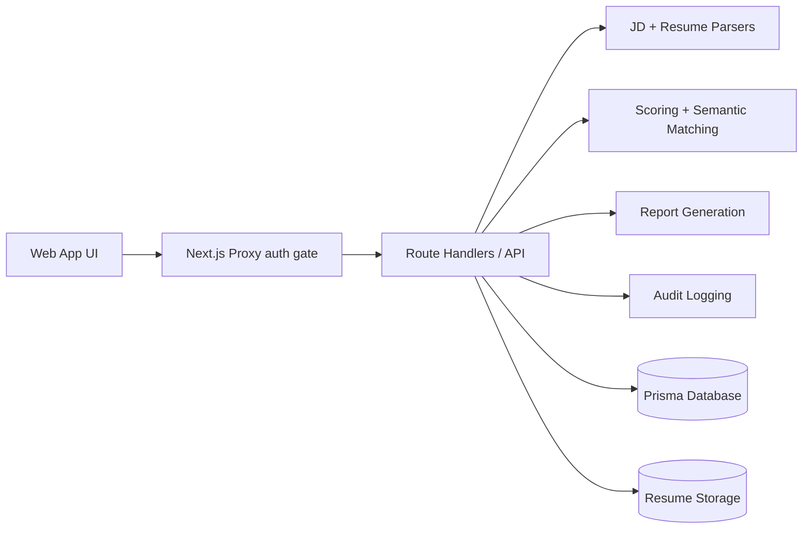

#  HireWise AI: HR Resume & LinkedIn Shortlisting Agent

[](https://nextjs.org/)
[](https://www.typescriptlang.org/)
[](https://www.prisma.io/)
[](https://tailwindcss.com/)
[](#)
[](#)

**HireWise AI** is an advanced HR tech platform designed to streamline the talent acquisition process. It acts as an intelligent shortlisting agent for recruiters, hiring managers and HR teams, helping them rapidly evaluate candidates against Job Descriptions (JDs) using transparent, AI-assisted scoring rubrics.

By eliminating manual screening fatigue and introducing deep semantic matching, HireWise AI empowers teams to make faster, fairer and highly auditable hiring decisions while keeping a "Human-in-the-Loop" for critical overrides.

---

##  Key Features & Capabilities

###  Enterprise-Grade Access & Security
- **Role-Based Access Control (RBAC):** Distinct workflows for `ADMIN`, `RECRUITER`, `HIRING_MANAGER` and `VIEWER`.
- **Organization-Scoped Data:** Multi-tenant architecture ensuring isolated candidate and job data.
- **Responsible AI Guardrails:** System strictly ignores protected attributes (gender, age, marital status, religion) to ensure bias-free screening.
- **Full Audit Logging:** Every profile update, score override, and status change is immutably logged.

###  Intelligent Data Ingestion
- **Robust Resume Parsing:** Extracts structured data from PDF and DOCX files securely.
- **LinkedIn Enrichment:** Supports importing JSON-formatted LinkedIn profile data to enrich candidate records.
- **Advanced Job Requisitions:** Capture complex criteria including salary ranges, required/preferred skills, certifications, and hard knockout constraints.

###  Advanced Scoring Engine
- **5-Dimensional Rubric:** Candidates are evaluated across:
  -  *Skills Match* (30%)
  -  *Experience Relevance* (25%)
  -  *Education & Certifications* (15%)
  -  *Projects & Portfolio* (20%)
  -  *Communication Quality* (10%)
- **Deterministic & Semantic Fallbacks:** Combines exact-match heuristics with semantic evaluation.
- **Explainable AI:** Generates one-line human-readable justifications for every dimension score.

###  Recruiter Workflows & Reporting
- **Interactive Shortlisting:** Rank candidates as `STRONG_SHORTLIST`, `SHORTLIST`, `HOLD`, or `REJECT`.
- **Hiring Manager Handoff:** Dedicated assignment state (`SENT_TO_HIRING_MANAGER`) for internal team review.
- **Human Overrides:** Recruiters can override AI scores (with mandatory justification).
- **Downloadable Reports:** Instantly generate comprehensive hiring reports in JSON, HTML, or PDF formats.
- **Visual Analytics:** Dashboard charts tracking skill gaps, pipeline velocity, and candidate source distribution.

---

##  Architecture & Tech Stack

HireWise AI is built on a modern, serverless-ready stack:

- **Core:** TypeScript, Node.js 20, Next.js `16.2.6` (App Router), React `19.2.4`, React DOM `19.2.4`.

- **Frontend / UI:** Tailwind CSS v4, PostCSS (`@tailwindcss/postcss`), `class-variance-authority`, `clsx`, `tailwind-merge`, `framer-motion`, `lucide-react`, `sonner`, `recharts`, `date-fns`.

- **Forms & Validation:** `react-hook-form`, `@hookform/resolvers`, `zod`.

- **Backend / API:** Next.js Route Handlers (Node.js runtime), built-in `fetch` for AI API calls.

- **Database & Data Layer:** Prisma ORM `6.19.0` (`prisma`, `@prisma/client`) with SQLite datasource (`prisma/schema.prisma`).

- **Auth & Security:** `jose` (JWT), `bcryptjs` (password hashing).

- **AI / LLM:** OpenAI-compatible API integration (`AI_BASE_URL`), `gpt-4o-mini` (`AI_MODEL`), `text-embedding-3-small` (`EMBEDDING_MODEL`), optional semantic embeddings pipeline.

- **Document Processing:** `mammoth`, `pdf2json`, `pdf-parse`, `pdf-lib`, `jspdf`, `uuid`.

- **Storage:** Local storage (`public/uploads`) with optional Vercel Blob support (`@vercel/blob`).

- **DevOps / Deployment:** Docker (multi-stage `Dockerfile`), Docker Compose (`docker-compose.yml`).

- **Developer Tooling:** ESLint v9, `eslint-config-next`, TypeScript v5, `tsx`, npm scripts for build/dev/lint and Prisma workflows.

### System Workflow


---

##  Getting Started (Local Development)

### Prerequisites
- Node.js (v20+ recommended)
- npm or yarn

### 1. Clone & Install
```bash
git clone https://github.com/shaguntalwar17/HR-Resume-and-LinkedIn-Shortlisting-Agent.git
cd hirewise-ai-shortlisting-agent
npm install
```

### 2. Environment Setup
Copy the example environment variables file and customize it if needed.
```bash
cp .env.example .env.local
```

### 3. Run the Development Server
```bash
npm run dev
```
Navigate to [http://localhost:3000](http://localhost:3000) to view the application.

### Demo Credentials
When `ENABLE_DEMO_MODE=true` is set, you can log in using the following accounts:
- **Admin:** `admin@hirewise.demo` / `DemoPass#123`
- **Recruiter:** `recruiter@hirewise.demo` / `DemoPass#123`
- **Hiring Manager:** `manager@hirewise.demo` / `DemoPass#123`

---

##  Docker Deployment

To run the application via Docker (with persistent volumes for the SQLite database and uploaded files):

```bash
docker compose up --build -d
```
The app will be available on `http://localhost:3000`.

---


---

##  Testing the End-to-End Workflow

1. **Login:** Access the dashboard as `recruiter@hirewise.demo`.
2. **Requisition Setup:** Create a new Job Requisition, defining the necessary skills and knockout criteria.
3. **Ingestion:** Navigate to the **Candidates** page and bulk-upload test PDF/DOCX resumes.
4. **Evaluation:** Return to the Job page and click **Run Evaluation** to score the candidates.
5. **Review:** Open the **Evaluations** tab to drill down into the generated rubrics and justifications.
6. **Action:** Assign a candidate to a Hiring Manager or apply a Human Override.
7. **Export:** Click **Download Report** to generate the final Shortlist PDF.

---

##  Responsible AI Statement
HireWise AI is designed as a **Decision Support System**, not an automated hiring arbiter. 
- It flags but does not strictly reject candidates without human review.
- It actively monitors for and strips out sensitive/protected status keywords before semantic scoring.
- Final disposition authority always rests with human recruiters.

---

## Snapshots of HireWise

### Landing Page
The entry point of the application, highlighting our core value propositions: Production Workflows, Transparent AI Scoring, and Responsible AI Guardrails.


### Role-Based Access
Secure login with predefined demo credentials for Admin, Recruiter, Hiring Manager, and Viewer roles to test end-to-end workflows.


---

##  Dashboard & Analytics

### Talent OS Dashboard
A high-level overview of active jobs, candidate funnels, and score distributions to keep recruiters informed at a glance.


### Advanced Analytics
Deep dive into application trends, shortlist conversion rates, and recruiter activity metrics.


---

##  Recruitment Workflow

### 1. Job Requisition
Define role scopes, mandatory "knockout" criteria, and specific skill requirements for AI evaluation.


### 2. Candidate Management
Batch upload resumes and enrich profiles with LinkedIn data to build a searchable candidate directory.


### 3. AI Evaluation Queue
Transparent scoring with automated "Matched Skills" and "Missing Skills" analysis. Candidates can be moved through statuses like `SENT_TO_HIRING_MANAGER` or `HOLD`.


### 4. Collaborative Shortlisting
A dedicated space for recruiters and hiring managers to collaborate on final candidate selections.


---

##  Reporting & Compliance

### Report Generation
Export comprehensive, recruiter-friendly reports in PDF, JSON, or HTML formats, including methodology and ranking logic.


### Sample PDF Output
An example of the generated Hiring Intelligence Report featuring ranked candidates and responsible AI disclaimers.


